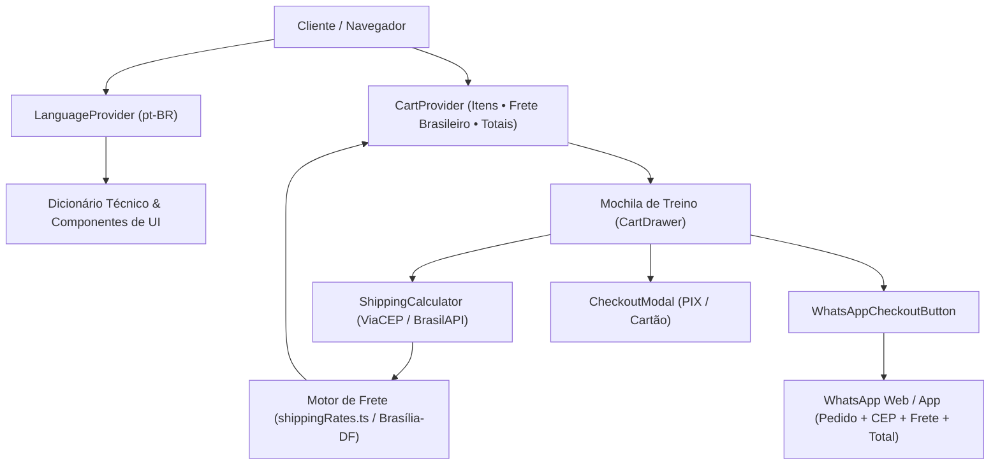

# Black Rhino Kimonos — Manual de Arquitetura & Documentação Oficial

> **Forjado para o Tatame. Feito para Durar.**  
> Plataforma digital e e-commerce técnico do ateliê especializado de kimonos de Jiu-Jitsu (BJJ) **Black Rhino Kimonos** — Fundado em Brasília, DF (Brasil) em 2017.

---

## Sumário
1. [Visão Geral & Filosofia da Marca](#1-visão-geral--filosofia-da-marca)
2. [Catálogo Oficial da Linha Legend & Tabela de Preços](#2-catálogo-oficial-da-linha-legend--tabela-de-preços)
3. [Engenharia de Recursos & Funcionalidades](#3-engenharia-de-recursos--funcionalidades)
   - [3.1 Matriz Interativa de Trançados](#31-matriz-interativa-de-trançados)
   - [3.2 Página de Faixas com Seletor de Graduação & Guia CBJJ](#32-página-de-faixas-com-seletor-de-graduação--guia-cbjj)
   - [3.3 Anatomia Técnica com Inspeção Macro-Zoom](#33-anatomia-técnica-com-inspeção-macro-zoom)
   - [3.4 Calculadora de Envergadura & Cortes Especiais (A0–A4, L, H)](#34-calculadora-de-envergadura--cortes-especiais-a0a4-l-h)
   - [3.5 Simulador de Lavagem & Encolhimento Sanforizado](#35-simulador-de-lavagem--encolhimento-sanforizado)
   - [3.6 Módulo de Peças Avulsas Legend (Calças e Vaguis)](#36-módulo-de-peças-avulsas-legend-calças-e-vaguis)
   - [3.7 Estúdio B2B de Bordados para Equipes & Academias](#37-estúdio-b2b-de-bordados-para-equipes--academias)
   - [3.8 Mochila de Treino (Carrinho) com Frete Grátis Inteligente](#38-mochila-de-treino-carrinho-com-frete-grátis-inteligente)
   - [3.9 Checkout Transparente com PIX Instantâneo & Cartão](#39-checkout-transparente-com-pix-instantâneo--cartão)
   - [3.10 Cálculo de Frete Estimado Brasileiro & Fechamento no WhatsApp](#310-cálculo-de-frete-estimado-brasileiro--fechamento-no-whatsapp)
4. [Identidade Visual & Design System Tático](#4-identidade-visual--design-system-tático)
5. [Stack Tecnológica & Dependências](#5-stack-tecnológica--dependências)
6. [Estrutura de Diretórios](#6-estrutura-de-diretórios)
7. [Fluxo de Dados & Gerenciamento de Estado](#7-fluxo-de-dados--gerenciamento-de-estado)
8. [Como Executar o Projeto Localmente](#8-como-executar-o-projeto-localmente)
9. [Instruções para Subida no Git (GitHub / GitLab)](#9-instruções-para-subida-no-git-github--gitlab)

---

## 1. Visão Geral & Filosofia da Marca

A **Black Rhino Kimonos** foi concebida para atender praticantes exigentes, professores casca-grossa e competidores internacionais de Jiu-Jitsu. 

Diferente de lojas convencionais de vestuário esportivo, a plataforma trata cada kimono como um equipamento de precisão milimétrica. A interface detalha a densidade têxtil (GSM), resistência à tração em Newtons, composição do núcleo da gola vulcanizada em EVA, tolerância de encolhimento pós-lavagem e homologação oficial segundo as regras internacionais da **CBJJ** e **IBJJF**.

- **Ateliê & Despacho**: Brasília, DF — Brasil
- **Moeda Nativa**: Real Brasileiro (`R$ / BRL`)
- **Idioma Nativo**: Português do Brasil (`pt-BR`)
- **Vocabulário do Tatame**: 100% autêntico da cultura brasileira de BJJ (trançados, vagui, lapela, pegada, rola, raspagem).

---

## 2. Catálogo Oficial da Linha Legend & Tabela de Preços

Todos os itens principais são estruturados sob a linha **Legend**, com precificação oficial em Reais (BRL):

| Categoria | Nome Oficial no Catálogo | Preço | Preço Sugerido | Especificações Técnicas |
| :--- | :--- | :--- | :--- | :--- |
| **Kimono Branco** | *Black Rhino 'Legend' 450 GSM Branco* | **R$ 479,00** | ~~R$ 549,00~~ | 450 GSM Compact Combed Pearl Weave • Calça Ripstop Diamantado 10 oz • Gola EVA vulcanizado anti-bacteriana |
| **Kimono Preto** | *Black Rhino 'Legend' 550 GSM Preto* | **R$ 489,00** | ~~R$ 560,00~~ | 550 GSM Trançado Pesado Double Weave • Lapela ultra-espessa de 12 camadas • Calça em Lona 10 oz |
| **Kimono Azul** | *Black Rhino 'Legend' 350 GSM Azul* | **R$ 510,00** | ~~R$ 580,00~~ | 350 GSM Micro-Pearl Weave Ultraleve • Peso sub-1.3kg • Secagem acelerada em 2.2 horas |
| **Faixas Graduadas** | *Black Rhino 'Legend' Faixa Trançada de Graduação* | **R$ 69,00** | ~~R$ 89,00~~ | 450 GSM Pearl Weave • Núcleo de lona 5mm • 12 Costuras paralelas • Ponteira de 10 cm • Firmeza de nó 9.5/10 |
| **Calça Avulsa** | *Calça Avulsa Black Rhino 'Legend' Ripstop 10 oz* | **R$ 189,00** | ~~R$ 220,00~~ | Ripstop Diamantado 10 oz com reforço entrepernas trançado de 450 GSM • Sistema de 6 passadores |
| **Vagui Avulso** | *Vagui Avulso Black Rhino 'Legend' Casaco* | **R$ 319,00** | ~~R$ 360,00~~ | Casaco de reposição com gola vulcanizada • Opções em 350 GSM, 450 GSM e 550 GSM |

---

## 3. Engenharia de Recursos & Funcionalidades

### 3.1 Matriz Interativa de Trançados
Localizada na home (`src/components/home/WeaveMatrixShowcase.tsx`), permite comparar lado a lado:
- **350 GSM Legend Azul**: Desenvolvido para bater peso limite na balança e treinar no calor.
- **450 GSM Legend Branco**: O padrão áureo de campeonatos mundiais, equilibrando estalo na pegada e mobilidade.
- **550 GSM Legend Preto**: O tanque dos tatames, com espessura máxima de gola para cansar o antebraço de passadores de guarda.

### 3.2 Página de Faixas com Seletor de Graduação & Guia CBJJ
Na página de produto de faixas (`src/components/pdp/ProductClientPage.tsx`):
- **Seletor de Graduação Oficial**: Botões dedicados para escolher entre **Faixa Branca, Azul, Roxa, Marrom e Preta**, integrando a graduação selecionada diretamente à mochila de treino.
- **Tamanhos em Metros**: Os botões de corte exibem os comprimentos reais (`A0: 2,50 m`, `A1: 2,70 m`, `A2: 2,90 m`, `A3: 3,10 m`, `A4: 3,30 m`).
- **Guia Regulamentar de Medidas**: Especificações oficiais das normas CBJJ e IBJJF (largura padrão de 4,2 cm, ponteira de 10 cm para colocação de graus, folga regulamentar de 20 a 30 cm após o nó e orientações de lavagem para não enfraquecer o núcleo interno).

### 3.3 Anatomia Técnica com Inspeção Macro-Zoom
Implementada em `src/components/home/TechnicalAnatomy.tsx`:
- Hotspots interativos mapeados nas coordenadas reais da peça:
  - **Gola em Espuma EVA Vulcanizada**: Núcleo de 12 camadas que repele absorção de suor e não deforma.
  - **Costura Tripla nos Ombros**: Reforço sem costura central na coluna para proteger as vértebras no tatame.
  - **Aberturas Laterais com Travete**: Acabamento com fita espinha de peixe anti-rasgo.
  - **Canal de 6 Passadores**: Mantém a calça firme no quadril durante berimbolos e inversões.

### 3.4 Calculadora de Envergadura & Cortes Especiais (A0–A4, L, H)
Implementada em `src/components/pdp/SizeCalculator.tsx`:
- Permite informar peso, altura e biotipo físico (`Longilíneo`, `Atlético Padrão` ou `Forte / Tronco Largo`).
- Recomenda com precisão tanto os cortes padrão (`A0` a `A4`) quanto os modelos anatômicos:
  - **Cortes L (A1L, A2L, A3L)**: Mangas e calças alongadas para atletas altos e magros, garantindo conformidade na medição do fiscal de tatame.
  - **Corte H (A2H)**: Tórax e dorsais expandidos para atletas pesados sem acréscimo desnecessário na saia do vagui.

### 3.5 Simulador de Lavagem & Encolhimento Sanforizado
Implementada em `src/components/pdp/ShrinkageVisualizer.tsx`:
- Simula o comportamento das fibras de algodão sanforizado em 3 protocolos:
  1. **Lavagem a Frio (< 30°C) + Secagem à Sombra**: Encolhimento < 0,8% (mantém medidas de fábrica).
  2. **Lavagem Morna (40°C)**: Perda dimensional de ~2,5% (ajuste fino entre tamanhos).
  3. **Água Quente + Secadora**: Encolhimento controlado de 4,5% a 6,0%.

### 3.6 Módulo de Peças Avulsas Legend (Calças e Vaguis)
Acessível em `/separates` (`src/app/separates/page.tsx`):
- Permite adquirir calças de reposição (Ripstop 10 oz ou Lona 10 oz nas cores Branco, Azul e Preto) ou casacos avulsos em qualquer uma das três gramaturas sem a necessidade de comprar o conjunto completo.

### 3.7 Estúdio B2B de Bordados para Equipes & Academias
Acessível em `/custom-academy` (`src/app/custom-academy/page.tsx`):
- Simulador interativo para professores e diretores de academia personalizarem uniformes com o brasão de sua equipe.
- Cálculo de desconto progressivo por quantidade de lote:
  - **Lote 15**: 15% de desconto
  - **Lote 30**: 25% de desconto
  - **Lote 50**: 35% de desconto + 1 Kimono Legend 450 cortesia com bordado dourado para o Professor Responsável
  - **Lote 100+**: 40% de desconto institucional

### 3.8 Mochila de Treino (Carrinho) com Frete Grátis Inteligente
Implementada em `src/components/cart/CartDrawer.tsx`:
- Barra de progresso dinâmica com meta de **R$ 350,00** para Frete Grátis em todo o Brasil.
- A compra de qualquer kimono Legend qualifica automaticamente para frete gratuito.
- Acessórios táticos em 1 clique (Esparadrapo Coesivo R$ 39, Cordão de Calça com Ponta de Silicone R$ 29, Saco Mochila de Ripstop R$ 79).

### 3.9 Checkout Transparente com PIX Instantâneo & Cartão
Implementado em `src/components/checkout/CheckoutModal.tsx`:
- Suporte a **PIX com QR Code dinâmico** e chave Copia e Cola instantânea.
- Cartão de crédito nacional e internacional.
- Cálculo automático de frete sincronizado com a cotação escolhida e aviso de *"Impostos & Tributos: Inclusos no Preço"*.

### 3.10 Cálculo de Frete Estimado Brasileiro & Fechamento no WhatsApp
Implementado em `src/components/cart/ShippingCalculator.tsx`, `src/lib/shipping.ts`, `src/data/shippingRates.ts` e `src/lib/whatsapp.ts`:
- **Consulta Aberta & Resiliente de CEP**:
  - Máscara automática de 8 dígitos (`00000-000`).
  - Consulta assíncrona gratuita via **ViaCEP** com fallback automático para **BrasilAPI**, identificando logradouro, bairro, cidade e estado sem custos ou necessidade de chaves de API pagas.
  - Link auxiliar *"Não sei meu CEP"* direcionando para a busca oficial dos Correios.
- **Tabela Regional Calibrada a partir de Brasília/DF (Origem do Ateliê - CEP 70800-200)**:
  - **Distrito Federal (Local)**: *Retirada no Ateliê (Grátis)*, *Motoboy Tatame DF (1 a 2 dias úteis)* e *SEDEX Local*.
  - **Demais Estados (SP, RJ, MG, Sul, Centro-Oeste, Nordeste, Norte)**: *PAC*, *SEDEX Expresso* e *Transportadora Jadlog (.Package)*.
  - **Cálculo Progressivo de Peso**: Considera o peso real dos kimonos (1,6 kg a 2,1 kg para trançados pesados 550 GSM), faixas e acessórios, aplicando taxa marginal para pacotes volumosos.
  - **Regra de Frete Grátis**: Compras a partir de **R$ 350,00** qualificam o PAC ou Retirada como **GRÁTIS (R$ 0,00)** automaticamente, mantendo a opção de SEDEX pago para atletas com urgência de campeonato.
- **Fechamento Consolidado no WhatsApp**:
  - O botão *"Finalizar Pedido via WhatsApp"* monta e codifica uma mensagem profissional com: Número do Pedido, Itens, Cortes/Tamanhos, Subtotal, Modalidade de Frete escolhida com prazo em dias úteis, Endereço de Entrega (CEP, Bairro, Cidade/UF) e **Total Final com frete**.
  - Permite envio mesmo se o cliente preferir não cotar o CEP (indicando frete *"A calcular no atendimento"* para nunca bloquear a conversão).
- **Arquitetura Pluggable (Evolução Futura)**:
  - Construído sob o padrão *Adapter*. Caso futuramente seja implementada uma função serverless intermediária com token do **Melhor Envio** ou **SuperFrete**, basta preencher a variável `NEXT_PUBLIC_SHIPPING_API_URL` sem precisar alterar o frontend ou o estado do carrinho.

---

## 4. Identidade Visual & Design System Tático

A interface foi concebida sob uma estética de alta durabilidade militar e funcionalidade de combate:

### Paleta de Cores
- **Obsidian Dark (Base)**:
  - `obsidian` (`#0F0F11`): Fundo principal do ateliê.
  - `obsidian-950` (`#08080A`): Barras de cabeçalho, modais e fundos profundos.
  - `slate-surface` (`#1C1D21`) e `slate-card` (`#222329`): Superfícies dos cards e painéis técnicos.
  - `slate-border` (`#2D2F36`): Bordas de precisão industrial.
- **Bone White (Tipografia)**:
  - `bonewhite-pure` (`#FFFFFF`): Títulos de destaque e números de medição.
  - `bonewhite` (`#F3F3F5`): Texto padrão de alta legibilidade.
  - `bonewhite-muted` (`#9FA3B0`): Textos técnicos e secundários.
  - `bonewhite-dim` (`#6B7280`): Rótulos de metadados e legendas.
- **Rhino Gold (Artesanal & Prestígio)**:
  - `rhinogold` (`#C5A880`), `rhinogold-light` (`#DFCAAB`), `rhinogold-dark` (`#9E825D`): Botões de conversão primária, estrelas de avaliação, badges de gramatura e detalhes artesanais.
- **Selos & Alertas**:
  - `emerald-400` / `emerald-950`: Homologação oficial CBJJ / IBJJF e status em estoque.
  - `matred` (`#E53E3E`): Avisos de urgência de estoque baixo e alertas de encolhimento a quente.

---

## 5. Stack Tecnológica & Dependências

| Camada | Tecnologia | Versão | Função Principal |
| :--- | :--- | :--- | :--- |
| **Framework** | Next.js (App Router) | `^15.1.0` | Arquitetura de páginas estáticas (SSG), rotas do servidor e otimização de imagens |
| **Biblioteca de UI** | React / React DOM | `^19.0.0` | Renderização declarativa com hooks modernos |
| **Tipagem** | TypeScript | `^5.7.2` | Tipagem estática fim a fim em produtos, tamanhos e contextos |
| **Estilização** | Tailwind CSS | `^3.4.16` | Design system baseado em utilitários com extensões temáticas |
| **Processamento CSS**| PostCSS & Autoprefixer| `^8.4.49` / `^10.4.20` | Compatibilidade cross-browser |
| **Ícones** | Lucide React | `^1.16.0` | Ícones táticos e esportivos |
| **Utilitários de Classe**| `clsx` & `tailwind-merge` | `^2.1.1` / `^2.5.5` | Manipulação condicional e segura de classes CSS |

---

## 6. Estrutura de Diretórios

```text
blackrhino/
├── public/                     # Arquivos públicos e imagens otimizadas do catálogo
│   └── images/products/        # Fotos de estúdio dos kimonos, calças, faixas e detalhes
├── images/                     # Acervo fotográfico original
├── src/
│   ├── app/                    # Rotas do Next.js App Router
│   │   ├── globals.css         # Diretivas Tailwind, variáveis e estilos de rolagem
│   │   ├── layout.tsx          # Layout raiz com Provedores e componentes globais
│   │   ├── page.tsx            # Página inicial cinemática do ateliê
│   │   ├── collections/
│   │   │   └── page.tsx        # Catálogo com filtros facetados por gramatura, corte e cor
│   │   ├── products/[slug]/
│   │   │   └── page.tsx        # Página de Produto dinâmica (SSG + componentes interativos)
│   │   ├── separates/
│   │   │   └── page.tsx        # Módulo de Peças Avulsas Legend (Calça e Vagui)
│   │   └── custom-academy/
│   │       └── page.tsx        # Estúdio de bordados e pedidos B2B para equipes
│   ├── components/
│   │   ├── cart/               # Mochila de treino (CartDrawer, ShippingCalculator, WhatsAppCheckoutButton)
│   │   ├── checkout/           # Modal de checkout com suporte a PIX e Cartão
│   │   ├── catalog/            # Barra de filtros facetados e cards de kimono
│   │   ├── home/               # Seção Hero, Matriz de Trançados, Anatomia e Depoimentos
│   │   ├── layout/             # Barra de Navegação, Rodapé e Barra Mobile
│   │   └── pdp/                # Seletor de graduação, galeria macro, calculadora e encolhimento
│   ├── context/
│   │   ├── CartContext.tsx     # Gerenciador de estado do carrinho, CEP, cotações e totais
│   │   └── LanguageContext.tsx # Contexto em português nativo (pt-BR)
│   ├── data/
│   │   ├── products.ts         # Base mestra de produtos, especificações, estoque e revisões
│   │   └── shippingRates.ts    # Tabela regional de frete por estado calibrada a partir de Brasília
│   ├── lib/
│   │   ├── imageLoader.ts      # Carregador de assets com basePath para GitHub Pages
│   │   ├── shipping.ts         # Motor de frete (ViaCEP, BrasilAPI e Adapter de cotações)
│   │   └── whatsapp.ts         # Formatador de pedido consolidado com frete para WhatsApp
│   ├── translations/
│   │   └── dictionary.ts       # Dicionário de termos técnicos do Jiu-Jitsu e textos de frete
│   └── types/
│       ├── product.ts          # Interfaces TypeScript (Product, GiCut, CartItem, etc.)
│       └── shipping.ts         # Interfaces de cotação de frete, endereço e transportadoras
├── next.config.ts              # Configuração oficial do Next.js
├── tailwind.config.ts          # Tema tático, paleta de cores e tipografia
├── tsconfig.json               # Configurações do TypeScript e alias (@/*)
├── package.json                # Dependências do projeto
└── README.md                   # Documentação técnica oficial
```

### 6.1 Mapeamento das Imagens do Catálogo (`public/images/products`)

Todos os assets fotográficos foram normalizados a partir do acervo original e mapeados para o diretório público de produção:

| Arquivo Original (`images/`) | Caminho Público (`public/images/products/`) | Produto Associado | Ângulo / Finalidade |
| :--- | :--- | :--- | :--- |
| `white-2026-09-19_11-37-04.png` | `white-gi-jacket.png` | Kimono Legend Branco | Visão frontal do casaco (Primária) |
| `white-2026-09-19_11-37-12.png` | `white-gi-pants.png` | Kimono Legend Branco | Calça Ripstop com passadores (Secundária) |
| `white-2026-09-19_11-37-24.png` | `white-gi-lapel-macro.png` | Kimono Legend Branco | Macro da gola em EVA vulcanizado |
| `blue-2026-09-19_11-38-32.png` | `blue-gi-jacket.png` | Kimono Legend Azul | Visão frontal do casaco (Primária) |
| `blue-2026-09-19_11-38-40.png` | `blue-gi-pants.png` | Kimono Legend Azul | Calça Ripstop azul (Secundária) |
| `blue-2026-09-19_11-37-43.png` | `blue-gi-collar-macro.png` | Kimono Legend Azul | Macro da lapela e trançado 350 GSM |
| `black-2026-09-19_11-39-05.png` | `black-gi-jacket-angle.png` | Kimono Legend Preto | Casaco em ângulo tático (Primária) |
| `black-2026-09-19_11-38-54.png` | `black-gi-bag-folded.png` | Kimono Legend Preto | Dobrado com a ecobag de transporte |
| `black-2026-09-19_11-39-13.png` | `black-gi-lapel-macro.png` | Kimono Legend Preto | Macro da lapela trançada 550 GSM |
| `black-2026-09-19_11-39-21.png` | `black-gi-pants.png` | Kimono Legend Preto | Calça em lona 10 oz preta (Secundária) |
| `belt-2026-09-19_11-39-44.png` | `belt-ranked-stack.png` | Faixa Legend | Pilha de graduações oficiais (Primária) |
| `belt-2026-09-19_11-39-34.png` | `belt-black-bag.png` | Faixa Legend | Faixa preta com sacola de ateliê |

### 6.2 Padrões de Deploy Estático (GitHub Pages)

Para garantir que o site funcione perfeitamente no GitHub Pages sob o subcaminho do repositório (`https://<usuario>.github.io/blackrhino/`):

1. **`basePath` e `assetPrefix`**: Configurados dinamicamente em `next.config.ts` com base no nome do repositório (`/blackrhino`) em produção, mantendo rota raiz limpa (`/`) em desenvolvimento local.
2. **Carregador de Imagens Personalizado (`src/lib/imageLoader.ts`)**: No Next.js estático (`output: 'export'`), as tags `next/image` não possuem servidor Node para rodar otimização em tempo real (`/_next/image`). O loader injeta o prefixo `/blackrhino` diretamente nos caminhos `/images/products/*`, evitando erro HTTP 404.
3. **Arquivo `.nojekyll`**: Adicionado em `public/.nojekyll` para que a engine padrão do GitHub Pages (Jekyll) não ignore pastas com prefixo sublinhado (como `_next/static`).
4. **Página `not-found.tsx`**: Implementada em `src/app/not-found.tsx` para gerar o `out/404.html` estático nativo do Next.js.
5. **Automação GitHub Actions (`.github/workflows/deploy.yml`)**: Workflow oficial configurado para compilar (`npm run build`) e publicar a pasta `out/` automaticamente a cada `git push`.

---

## 7. Fluxo de Dados & Gerenciamento de Estado



1. **`CartContext`** (`src/context/CartContext.tsx`):
   - Gerencia itens adicionados, graduação da faixa, corte, quantidades, CEP (`shippingCep`), endereço (`shippingAddress`), cotações (`shippingQuotes`), frete selecionado (`selectedShippingQuote`), custo de frete (`shippingCost`) e valor total final (`finalTotal`).
   - Recalcula dinamicamente se o subtotal ultrapassar **R$ 350,00** para habilitar Frete Grátis instantâneo.
   - Persistência automática em `localStorage` sob `blackrhino_cart`, `blackrhino_shipping_cep` e `blackrhino_shipping_address`.
2. **`LanguageContext`** (`src/context/LanguageContext.tsx`):
   - Estabelece o português (`pt`) como idioma padrão permanente.
   - Fornece o helper `t(chave)` conectado ao dicionário centralizado.

---

## 8. Como Executar o Projeto Localmente

### Pré-requisitos
- **Node.js**: Versão 18.18+ ou 20+ LTS instalada.
- **Gerenciador de Pacotes**: `npm` (ou `pnpm` / `yarn`).

### Passo a Passo

1. **Instalar as dependências**:
   ```bash
   npm install
   ```

2. **Executar o ambiente de desenvolvimento**:
   ```bash
   npm run dev
   ```
   Acesse a aplicação no seu navegador em: [http://localhost:3000](http://localhost:3000).

3. **Gerar a compilação de produção (build estático)**:
   ```bash
   npm run build
   ```

4. **Executar o servidor de produção**:
   ```bash
   npm start
   ```

---

## 9. Instruções para Subida no Git (GitHub / GitLab)

O repositório já está configurado com `.gitignore` adequado, protegendo os diretórios temporários (`.next/`, `node_modules/`).

Para vincular este projeto ao seu repositório remoto e realizar o envio inicial:

```bash
# 1. Definir a branch principal como main
git branch -M main

# 2. Adicionar todos os arquivos do projeto
git add .

# 3. Criar o commit inicial com mensagem semântica
git commit -m "feat: plataforma Black Rhino Kimonos - linha Legend, atelie em Brasilia e documentacao tecnica"

# 4. Vincular ao seu repositorio remoto (substitua pela URL do seu repositorio no GitHub/GitLab)
git remote add origin git@github.com:seu-usuario/blackrhino.git
# ou via HTTPS:
# git remote add origin https://github.com/seu-usuario/blackrhino.git

# 5. Enviar para a nuvem
git push -u origin main
```

---

*Black Rhino Kimonos Brasil • Brasília, DF • Desde 2017 • Soli Deo Gloria • Forjado no Tatame.*
